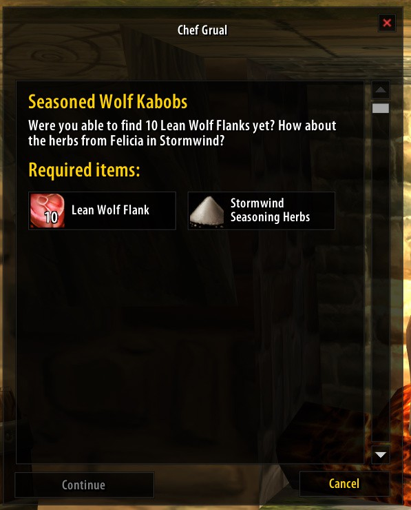
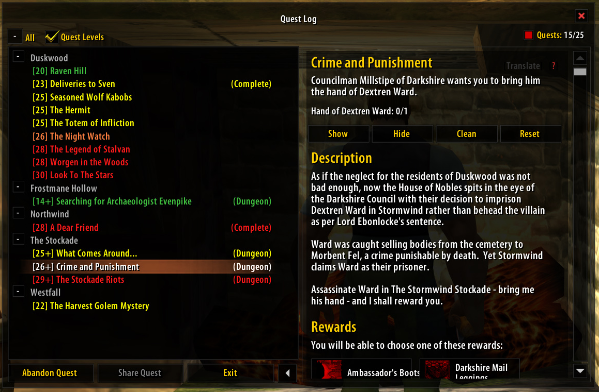
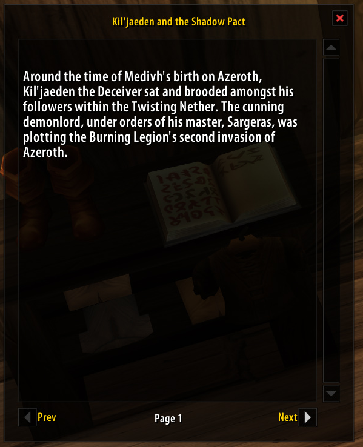
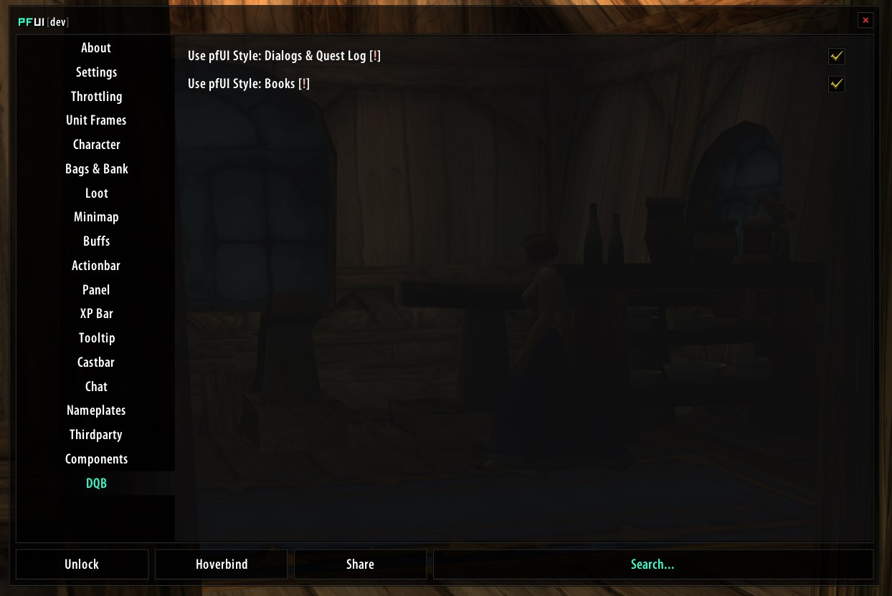

# pfUI-DQB

**pfUI-DQB** is a lightweight customization addon for **pfUI** that enhances the appearance of Blizzard's Quest, Gossip, Quest Log and Book interfaces while keeping pfUI's original frame styling intact.

The project was created for **OctoWoW / World of Warcraft Vanilla 1.12.1** and is designed specifically around the pfUI version maintained by [**brues**](https://github.com/brues-code/pfUI).

> **pfUI-DQB does not replace pfUI.**
>
> It works as an additional customization layer on top of pfUI's existing Blizzard UI skins.

---

## ✨ Features

pfUI-DQB currently provides two modules:

### 💬 Dialogs & Quest Log

The **Dialogs & Quest Log** option controls:

* Gossip windows
* Quest windows
* Quest text
* Quest titles
* Quest objectives
* Quest rewards
* NPC names
* Gossip and quest option buttons
* Quest parchment backgrounds
* Quest scroll areas
* Quest reward item presentation
* Quest Log text and layout customizations

The original **pfUI frame remains intact**.

This means that when DQB is enabled:

* The pfUI frame is still used
* The pfUI frame styling is preserved
* The pfUI frame remains movable
* The pfUI buttons remain pfUI styled
* DQB only applies its additional visual customizations

### 📖 Books

The **Books** option controls Item Text interface.

It provides:

* Dark translucent book background
* Gold title
* White page text
* White page number
* pfUI styled navigation buttons
* pfUI styled scrollbar
* Preserved pfUI frame
* Removal of the original parchment appearance

The book frame itself continues to use pfUI's styling.

---

## 🎨 Visual Style

The main visual goal of pfUI-DQB is to replace Blizzard's original parchment-heavy appearance with a darker, cleaner presentation that fits naturally into pfUI.

### Text

| Element   | Color |
| --------- | ----- |
| Main text | White |
| Titles    | Gold  |
| Shadows   | Black |

### Background

Quest, Gossip and Book text areas use a:

**Black / 10% alpha translucent background**

instead of Blizzard's original parchment texture.

---

## ⚙️ Configuration

pfUI-DQB adds its own configuration section to the pfUI configuration interface:

```text
DQB
│
├── Use pfUI Style: Dialogs & Quest Log
│
└── Use pfUI Style: Books
```

Each option can be enabled or disabled independently.

### Dialogs & Quest Log

Controls:

```text
gossipquest.lua
questlog.lua
```

### Books

Controls:

```text
itemtext.lua
```

Changes are applied after reloading the UI.

You can use:

```text
/reload
```

or:

```text
/rl
```

---

## 🔧 How It Works

pfUI-DQB is designed to work **alongside** pfUI rather than replacing its Blizzard skin files.

When DQB is disabled, pfUI behaves normally.

When a DQB option is enabled, the corresponding DQB module applies additional modifications to the already skinned pfUI interface.

Conceptually:

```text
Blizzard UI
     │
     ▼
   pfUI
     │
     ▼
  pfUI-DQB
     │
     ▼
Final Interface
```

This approach allows pfUI-DQB to preserve the existing pfUI frame structure while changing specific elements such as colors and parchment backgrounds.

---

## 📦 Auto-Installation

1. Use github link to install ```https://github.com/jKalfis/pfUI-DQB```

## 📦 Installation

1. [Dowload](https://github.com/jKalfis/pfUI-DQB/releases) the latest pfUI-DQB release.
2. Extract the addon.
3. **Rename folder to `pfUI-DQB` make sure folder has the same name as the `pfUI-DQB.toc` file inside.**
4. Place the `pfUI-DQB` folder inside:

```text
your OctoWoW folder/
          └── Interface/
                └── AddOns/
                      └── pfUI-DQB/
```

5. Make sure **pfUI** is installed and enabled.
6. Start the game.
7. Open the pfUI configuration.
8. Find the **DQB** section.
9. Enable the desired options.
10. Reload the UI.

---

## ⚠️ Compatibility

### Supported pfUI

pfUI-DQB is developed specifically for:

[**brues's pfUI - ClassicAPI Edition**](https://github.com/brues-code/pfUI)

Repository:

https://github.com/brues-code/pfUI

The target pfUI branch/version is the version used by **OctoWoW** and its ClassicAPI-based Vanilla environment.

The brues-code pfUI fork is specifically described as requiring **ClassicAPI**, which is relevant to the environment this addon was developed for.

### Other pfUI versions

> **Compatibility with other pfUI forks, branches or versions is not guaranteed.**

pfUI has multiple forks and versions, and its internal API and Blizzard skin implementation may differ between them.

Because pfUI-DQB works with pfUI's existing UI structures and API, changes to those structures may cause the addon to stop working correctly.

If you are using a different pfUI version, please test carefully.

---

## 🎮 Game Version

pfUI-DQB is developed for:

```text
World of Warcraft Vanilla 1.12.1
```

and specifically for the **OctoWoW environment**.

The addon was developed and tested around the pfUI + ClassicAPI environment created by brues.

---

## 🧩 Requirements

pfUI-DQB requires:

* World of Warcraft Vanilla 1.12.1
* The compatible pfUI version maintained by brues-code
* ClassicAPI / compatible OctoWoW environment

pfUI must be loaded for pfUI-DQB to initialize.

---

## 🗂️ Project Structure

The addon is organized into a small core system and independent modules:

```text
pfUI-DQB/
│
├── pfUI-DQB.toc
│
├── core.lua
├── config.lua
├── gui.lua
│
└── modules/
    ├── gossipquest.lua
    ├── questlog.lua
    └── itemtext.lua
```

### Core

`core.lua`

Handles:

* Main DQB namespace
* Module registration
* Configuration access
* Module initialization
* pfUI integration

### Configuration

`config.lua`

Handles:

* Default configuration
* SavedVariables
* DQB module settings

### GUI

`gui.lua`

Adds the DQB configuration section to pfUI.

### Modules

`gossipquest.lua`

Handles Gossip and Quest dialog customization.

`questlog.lua`

Handles Quest Log customization.

`itemtext.lua`

Handles Books / Item Text customization.

---

## 🔄 DQB OFF vs ON

### DQB disabled

The corresponding interface uses the normal pfUI appearance.

```text
pfUI
└── Blizzard UI skin
```

### DQB enabled

The same pfUI interface receives the additional DQB customization.

```text
pfUI
└── Blizzard UI skin
     └── pfUI-DQB customization
```

DQB does **not** create a second giant replacement frame over the pfUI frame.

That distinction is intentional.

---

## 🛠️ Development

pfUI-DQB started as a collection of modifications made directly to pfUI's Blizzard skin files.

The working modifications were then converted into an independent addon so that:

* pfUI itself does not need to be modified
* pfUI updates do not require manually reapplying changes
* DQB options can be enabled or disabled independently
* The original pfUI frame styling remains intact

The long-term goal is to continue expanding this architecture without unnecessarily modifying pfUI itself.

---

## 🚧 Current Status

**Version 1.0.0**

The following modules are currently implemented and tested:

* ✅ Gossip & Quest dialogs
* ✅ Quest Log
* ✅ Books / Item Text
* ✅ pfUI configuration integration
* ✅ Independent module configuration
* ✅ Saved configuration
* ✅ Reload persistence
* ✅ Dark translucent text backgrounds
* ✅ Quest and Gossip text customization
* ✅ Book text customization
* ✅ pfUI frame preservation

---

## 📸 Screenshots


### Gossip & Quest




### Quest Log




### Books




### DQB Configuration





---

## 📋 Changelog

### v1.0.0

Initial stable release.

* Added pfUI-DQB core system
* Added pfUI configuration integration
* Added Gossip & Quest customization
* Added Quest Log customization
* Added Books / Item Text customization
* Added independent module toggles
* Added saved configuration
* Added dark translucent parchment replacement
* Added white/gold text styling
* Preserved pfUI frame styling

---

## 📜 License

pfUI-DQB is an independent addon project.

It is designed to work with pfUI but is **not part of pfUI**.

For pfUI itself, please refer to the original project and its license:

https://github.com/brues-code/pfUI

---

## ❤️ Credits

### pfUI

Created and maintained by the pfUI project and contributors.

pfUI is a full UI replacement for World of Warcraft Vanilla and has its own independent development history and licensing.

### pfUI-DQB

Developed as an independent customization layer for the pfUI environment used by OctoWoW.

---

## ⭐ Final Note

pfUI-DQB was created by jKalfis, with one simple idea:

> **Keep pfUI. Keep its frames. Keep its style. Just make Blizzard's parchment interfaces look better.**

More customization modules may be added in future versions.
